#### Let us first import the required libraries and read the CSV file


```python
import pandas as pd
df = pd.read_csv("train.csv")
df
```


<div>
<style scoped>
    .dataframe tbody tr th:only-of-type {
        vertical-align: middle;
    }

    .dataframe tbody tr th {
        vertical-align: top;
    }

    .dataframe thead th {
        text-align: right;
    }
</style>
<table border="1" class="dataframe">
  <thead>
    <tr style="text-align: right;">
      <th></th>
      <th>Id</th>
      <th>MSSubClass</th>
      <th>MSZoning</th>
      <th>LotFrontage</th>
      <th>LotArea</th>
      <th>Street</th>
      <th>Alley</th>
      <th>LotShape</th>
      <th>LandContour</th>
      <th>Utilities</th>
      <th>...</th>
      <th>PoolArea</th>
      <th>PoolQC</th>
      <th>Fence</th>
      <th>MiscFeature</th>
      <th>MiscVal</th>
      <th>MoSold</th>
      <th>YrSold</th>
      <th>SaleType</th>
      <th>SaleCondition</th>
      <th>SalePrice</th>
    </tr>
  </thead>
  <tbody>
    <tr>
      <th>0</th>
      <td>1</td>
      <td>60</td>
      <td>RL</td>
      <td>65.0</td>
      <td>8450</td>
      <td>Pave</td>
      <td>NaN</td>
      <td>Reg</td>
      <td>Lvl</td>
      <td>AllPub</td>
      <td>...</td>
      <td>0</td>
      <td>NaN</td>
      <td>NaN</td>
      <td>NaN</td>
      <td>0</td>
      <td>2</td>
      <td>2008</td>
      <td>WD</td>
      <td>Normal</td>
      <td>208500</td>
    </tr>
    <tr>
      <th>1</th>
      <td>2</td>
      <td>20</td>
      <td>RL</td>
      <td>80.0</td>
      <td>9600</td>
      <td>Pave</td>
      <td>NaN</td>
      <td>Reg</td>
      <td>Lvl</td>
      <td>AllPub</td>
      <td>...</td>
      <td>0</td>
      <td>NaN</td>
      <td>NaN</td>
      <td>NaN</td>
      <td>0</td>
      <td>5</td>
      <td>2007</td>
      <td>WD</td>
      <td>Normal</td>
      <td>181500</td>
    </tr>
    <tr>
      <th>2</th>
      <td>3</td>
      <td>60</td>
      <td>RL</td>
      <td>68.0</td>
      <td>11250</td>
      <td>Pave</td>
      <td>NaN</td>
      <td>IR1</td>
      <td>Lvl</td>
      <td>AllPub</td>
      <td>...</td>
      <td>0</td>
      <td>NaN</td>
      <td>NaN</td>
      <td>NaN</td>
      <td>0</td>
      <td>9</td>
      <td>2008</td>
      <td>WD</td>
      <td>Normal</td>
      <td>223500</td>
    </tr>
    <tr>
      <th>3</th>
      <td>4</td>
      <td>70</td>
      <td>RL</td>
      <td>60.0</td>
      <td>9550</td>
      <td>Pave</td>
      <td>NaN</td>
      <td>IR1</td>
      <td>Lvl</td>
      <td>AllPub</td>
      <td>...</td>
      <td>0</td>
      <td>NaN</td>
      <td>NaN</td>
      <td>NaN</td>
      <td>0</td>
      <td>2</td>
      <td>2006</td>
      <td>WD</td>
      <td>Abnorml</td>
      <td>140000</td>
    </tr>
    <tr>
      <th>4</th>
      <td>5</td>
      <td>60</td>
      <td>RL</td>
      <td>84.0</td>
      <td>14260</td>
      <td>Pave</td>
      <td>NaN</td>
      <td>IR1</td>
      <td>Lvl</td>
      <td>AllPub</td>
      <td>...</td>
      <td>0</td>
      <td>NaN</td>
      <td>NaN</td>
      <td>NaN</td>
      <td>0</td>
      <td>12</td>
      <td>2008</td>
      <td>WD</td>
      <td>Normal</td>
      <td>250000</td>
    </tr>
    <tr>
      <th>...</th>
      <td>...</td>
      <td>...</td>
      <td>...</td>
      <td>...</td>
      <td>...</td>
      <td>...</td>
      <td>...</td>
      <td>...</td>
      <td>...</td>
      <td>...</td>
      <td>...</td>
      <td>...</td>
      <td>...</td>
      <td>...</td>
      <td>...</td>
      <td>...</td>
      <td>...</td>
      <td>...</td>
      <td>...</td>
      <td>...</td>
      <td>...</td>
    </tr>
    <tr>
      <th>1455</th>
      <td>1456</td>
      <td>60</td>
      <td>RL</td>
      <td>62.0</td>
      <td>7917</td>
      <td>Pave</td>
      <td>NaN</td>
      <td>Reg</td>
      <td>Lvl</td>
      <td>AllPub</td>
      <td>...</td>
      <td>0</td>
      <td>NaN</td>
      <td>NaN</td>
      <td>NaN</td>
      <td>0</td>
      <td>8</td>
      <td>2007</td>
      <td>WD</td>
      <td>Normal</td>
      <td>175000</td>
    </tr>
    <tr>
      <th>1456</th>
      <td>1457</td>
      <td>20</td>
      <td>RL</td>
      <td>85.0</td>
      <td>13175</td>
      <td>Pave</td>
      <td>NaN</td>
      <td>Reg</td>
      <td>Lvl</td>
      <td>AllPub</td>
      <td>...</td>
      <td>0</td>
      <td>NaN</td>
      <td>MnPrv</td>
      <td>NaN</td>
      <td>0</td>
      <td>2</td>
      <td>2010</td>
      <td>WD</td>
      <td>Normal</td>
      <td>210000</td>
    </tr>
    <tr>
      <th>1457</th>
      <td>1458</td>
      <td>70</td>
      <td>RL</td>
      <td>66.0</td>
      <td>9042</td>
      <td>Pave</td>
      <td>NaN</td>
      <td>Reg</td>
      <td>Lvl</td>
      <td>AllPub</td>
      <td>...</td>
      <td>0</td>
      <td>NaN</td>
      <td>GdPrv</td>
      <td>Shed</td>
      <td>2500</td>
      <td>5</td>
      <td>2010</td>
      <td>WD</td>
      <td>Normal</td>
      <td>266500</td>
    </tr>
    <tr>
      <th>1458</th>
      <td>1459</td>
      <td>20</td>
      <td>RL</td>
      <td>68.0</td>
      <td>9717</td>
      <td>Pave</td>
      <td>NaN</td>
      <td>Reg</td>
      <td>Lvl</td>
      <td>AllPub</td>
      <td>...</td>
      <td>0</td>
      <td>NaN</td>
      <td>NaN</td>
      <td>NaN</td>
      <td>0</td>
      <td>4</td>
      <td>2010</td>
      <td>WD</td>
      <td>Normal</td>
      <td>142125</td>
    </tr>
    <tr>
      <th>1459</th>
      <td>1460</td>
      <td>20</td>
      <td>RL</td>
      <td>75.0</td>
      <td>9937</td>
      <td>Pave</td>
      <td>NaN</td>
      <td>Reg</td>
      <td>Lvl</td>
      <td>AllPub</td>
      <td>...</td>
      <td>0</td>
      <td>NaN</td>
      <td>NaN</td>
      <td>NaN</td>
      <td>0</td>
      <td>6</td>
      <td>2008</td>
      <td>WD</td>
      <td>Normal</td>
      <td>147500</td>
    </tr>
  </tbody>
</table>
<p>1460 rows × 81 columns</p>
</div>


#### Understand the list of columns, data types, null values, types of values present along with uni-variate analysis


```python
# Below are the columns I am going to focus as there are 80 columns
# MSSubClass, MSZoning, LotArea, LandContour, Utilities, 
# OverallQual, YearRemodAdd, Foundation, GarageType, SaleCondition, SalePrice 

# Let us create a subset dataframe with these columns alone
df1 = df[["MSSubClass","MSZoning", "LotArea", "LandContour", "Utilities", "OverallQual", "YearBuilt", "YearRemodAdd", "Foundation", "GarageType", "SaleCondition", "SalePrice" ]]
df1.info()

# All the column data type seems to match with the data description given 
# except YearRemodAdd as it is a year but datatype is int64
# Checking the values in YearRemodAdd
print(df1.YearRemodAdd.value_counts())

# Let us now convert it into Date field with format Y
df1['YearRemodAdd'] = pd.to_datetime(df1['YearRemodAdd'], format = "%Y", exact = True)
df1['YearBuilt'] = pd.to_datetime(df1['YearBuilt'], format = "%Y", exact = True)


df1.info()
```

    <class 'pandas.core.frame.DataFrame'>
    RangeIndex: 1460 entries, 0 to 1459
    Data columns (total 12 columns):
     #   Column         Non-Null Count  Dtype 
    ---  ------         --------------  ----- 
     0   MSSubClass     1460 non-null   int64 
     1   MSZoning       1460 non-null   object
     2   LotArea        1460 non-null   int64 
     3   LandContour    1460 non-null   object
     4   Utilities      1460 non-null   object
     5   OverallQual    1460 non-null   int64 
     6   YearBuilt      1460 non-null   int64 
     7   YearRemodAdd   1460 non-null   int64 
     8   Foundation     1460 non-null   object
     9   GarageType     1379 non-null   object
     10  SaleCondition  1460 non-null   object
     11  SalePrice      1460 non-null   int64 
    dtypes: int64(6), object(6)
    memory usage: 137.0+ KB
    1950    178
    2006     97
    2007     76
    2005     73
    2004     62
           ... 
    2010      6
    1983      5
    1952      5
    1986      5
    1951      4
    Name: YearRemodAdd, Length: 61, dtype: int64
    <class 'pandas.core.frame.DataFrame'>
    RangeIndex: 1460 entries, 0 to 1459
    Data columns (total 12 columns):
     #   Column         Non-Null Count  Dtype         
    ---  ------         --------------  -----         
     0   MSSubClass     1460 non-null   int64         
     1   MSZoning       1460 non-null   object        
     2   LotArea        1460 non-null   int64         
     3   LandContour    1460 non-null   object        
     4   Utilities      1460 non-null   object        
     5   OverallQual    1460 non-null   int64         
     6   YearBuilt      1460 non-null   datetime64[ns]
     7   YearRemodAdd   1460 non-null   datetime64[ns]
     8   Foundation     1460 non-null   object        
     9   GarageType     1379 non-null   object        
     10  SaleCondition  1460 non-null   object        
     11  SalePrice      1460 non-null   int64         
    dtypes: datetime64[ns](2), int64(4), object(6)
    memory usage: 137.0+ KB


    <ipython-input-126-2c495b6726b3>:15: SettingWithCopyWarning: 
    A value is trying to be set on a copy of a slice from a DataFrame.
    Try using .loc[row_indexer,col_indexer] = value instead
    
    See the caveats in the documentation: https://pandas.pydata.org/pandas-docs/stable/user_guide/indexing.html#returning-a-view-versus-a-copy
      df1['YearRemodAdd'] = pd.to_datetime(df1['YearRemodAdd'], format = "%Y", exact = True)
    <ipython-input-126-2c495b6726b3>:16: SettingWithCopyWarning: 
    A value is trying to be set on a copy of a slice from a DataFrame.
    Try using .loc[row_indexer,col_indexer] = value instead
    
    See the caveats in the documentation: https://pandas.pydata.org/pandas-docs/stable/user_guide/indexing.html#returning-a-view-versus-a-copy
      df1['YearBuilt'] = pd.to_datetime(df1['YearBuilt'], format = "%Y", exact = True)


```python
# Let us first see the null values
print(df1.isnull().sum())

# Checking the type of data present in GarageType NULL values
df1[df1.GarageType.isnull()]
```

    MSSubClass        0
    MSZoning          0
    LotArea           0
    LandContour       0
    Utilities         0
    OverallQual       0
    YearBuilt         0
    YearRemodAdd      0
    Foundation        0
    GarageType       81
    SaleCondition     0
    SalePrice         0
    dtype: int64


<div>
<style scoped>
    .dataframe tbody tr th:only-of-type {
        vertical-align: middle;
    }

    .dataframe tbody tr th {
        vertical-align: top;
    }

    .dataframe thead th {
        text-align: right;
    }
</style>
<table border="1" class="dataframe">
  <thead>
    <tr style="text-align: right;">
      <th></th>
      <th>MSSubClass</th>
      <th>MSZoning</th>
      <th>LotArea</th>
      <th>LandContour</th>
      <th>Utilities</th>
      <th>OverallQual</th>
      <th>YearBuilt</th>
      <th>YearRemodAdd</th>
      <th>Foundation</th>
      <th>GarageType</th>
      <th>SaleCondition</th>
      <th>SalePrice</th>
    </tr>
  </thead>
  <tbody>
    <tr>
      <th>39</th>
      <td>90</td>
      <td>RL</td>
      <td>6040</td>
      <td>Lvl</td>
      <td>AllPub</td>
      <td>4</td>
      <td>1955-01-01</td>
      <td>1955-01-01</td>
      <td>PConc</td>
      <td>NaN</td>
      <td>AdjLand</td>
      <td>82000</td>
    </tr>
    <tr>
      <th>48</th>
      <td>190</td>
      <td>RM</td>
      <td>4456</td>
      <td>Lvl</td>
      <td>AllPub</td>
      <td>4</td>
      <td>1920-01-01</td>
      <td>2008-01-01</td>
      <td>BrkTil</td>
      <td>NaN</td>
      <td>Partial</td>
      <td>113000</td>
    </tr>
    <tr>
      <th>78</th>
      <td>90</td>
      <td>RL</td>
      <td>10778</td>
      <td>Lvl</td>
      <td>AllPub</td>
      <td>4</td>
      <td>1968-01-01</td>
      <td>1968-01-01</td>
      <td>CBlock</td>
      <td>NaN</td>
      <td>Normal</td>
      <td>136500</td>
    </tr>
    <tr>
      <th>88</th>
      <td>50</td>
      <td>C (all)</td>
      <td>8470</td>
      <td>Lvl</td>
      <td>AllPub</td>
      <td>3</td>
      <td>1915-01-01</td>
      <td>1982-01-01</td>
      <td>CBlock</td>
      <td>NaN</td>
      <td>Abnorml</td>
      <td>85000</td>
    </tr>
    <tr>
      <th>89</th>
      <td>20</td>
      <td>RL</td>
      <td>8070</td>
      <td>Lvl</td>
      <td>AllPub</td>
      <td>4</td>
      <td>1994-01-01</td>
      <td>1995-01-01</td>
      <td>PConc</td>
      <td>NaN</td>
      <td>Normal</td>
      <td>123600</td>
    </tr>
    <tr>
      <th>...</th>
      <td>...</td>
      <td>...</td>
      <td>...</td>
      <td>...</td>
      <td>...</td>
      <td>...</td>
      <td>...</td>
      <td>...</td>
      <td>...</td>
      <td>...</td>
      <td>...</td>
      <td>...</td>
    </tr>
    <tr>
      <th>1349</th>
      <td>70</td>
      <td>RM</td>
      <td>5250</td>
      <td>Lvl</td>
      <td>AllPub</td>
      <td>8</td>
      <td>1872-01-01</td>
      <td>1987-01-01</td>
      <td>BrkTil</td>
      <td>NaN</td>
      <td>Normal</td>
      <td>122000</td>
    </tr>
    <tr>
      <th>1407</th>
      <td>20</td>
      <td>RL</td>
      <td>8780</td>
      <td>Lvl</td>
      <td>AllPub</td>
      <td>5</td>
      <td>1985-01-01</td>
      <td>1985-01-01</td>
      <td>CBlock</td>
      <td>NaN</td>
      <td>Normal</td>
      <td>112000</td>
    </tr>
    <tr>
      <th>1449</th>
      <td>180</td>
      <td>RM</td>
      <td>1533</td>
      <td>Lvl</td>
      <td>AllPub</td>
      <td>5</td>
      <td>1970-01-01</td>
      <td>1970-01-01</td>
      <td>CBlock</td>
      <td>NaN</td>
      <td>Abnorml</td>
      <td>92000</td>
    </tr>
    <tr>
      <th>1450</th>
      <td>90</td>
      <td>RL</td>
      <td>9000</td>
      <td>Lvl</td>
      <td>AllPub</td>
      <td>5</td>
      <td>1974-01-01</td>
      <td>1974-01-01</td>
      <td>CBlock</td>
      <td>NaN</td>
      <td>Normal</td>
      <td>136000</td>
    </tr>
    <tr>
      <th>1453</th>
      <td>20</td>
      <td>RL</td>
      <td>17217</td>
      <td>Lvl</td>
      <td>AllPub</td>
      <td>5</td>
      <td>2006-01-01</td>
      <td>2006-01-01</td>
      <td>PConc</td>
      <td>NaN</td>
      <td>Abnorml</td>
      <td>84500</td>
    </tr>
  </tbody>
</table>
<p>81 rows × 12 columns</p>
</div>


```python
#As you can see the null values are Nan. But actually NA in GarageType is the value which denotes NULL values
# Now let us see how many 'NA' values we have for GarageType
print(df1.GarageType.value_counts())

#Looks like the NA values are treated as NaN for Garage types, which makes sense. We can leave it as it is.
```

    Attchd     870
    Detchd     387
    BuiltIn     88
    Basment     19
    CarPort      9
    2Types       6
    Name: GarageType, dtype: int64


#### Let us start bi-variate analysis


```python
# Let us see how the size of the lot varies with sub class and zoning
import matplotlib.pyplot as plt
plt.bar(df1['MSSubClass'], df1['LotArea'])
plt.show()

#Looks like the lot area is more for lesser values which is 20 (1-STORY 1946 & NEWER ALL STYLES) 
# and then it increases for 190 (2 FAMILY CONVERSION - ALL STYLES AND AGES)
```


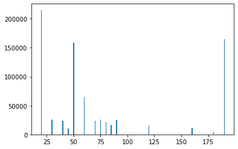


```python
# But there is no data shown for many values like 150. Let us identify why.
df1[(df1['MSSubClass'] == 150)]

#Looks like there are no lots in the classes 1-1/2 STORY PUD - ALL AGES
```


<div>
<style scoped>
    .dataframe tbody tr th:only-of-type {
        vertical-align: middle;
    }

    .dataframe tbody tr th {
        vertical-align: top;
    }

    .dataframe thead th {
        text-align: right;
    }
</style>
<table border="1" class="dataframe">
  <thead>
    <tr style="text-align: right;">
      <th></th>
      <th>MSSubClass</th>
      <th>MSZoning</th>
      <th>LotArea</th>
      <th>LandContour</th>
      <th>Utilities</th>
      <th>OverallQual</th>
      <th>YearBuilt</th>
      <th>YearRemodAdd</th>
      <th>Foundation</th>
      <th>GarageType</th>
      <th>SaleCondition</th>
      <th>SalePrice</th>
    </tr>
  </thead>
  <tbody>
  </tbody>
</table>
</div>


```python
# Now let us check the lot areas available in each zone
plt.bar(df1['MSZoning'], df1['LotArea'])
plt.show()

# The lot area is more in RL Residential Low Density
```


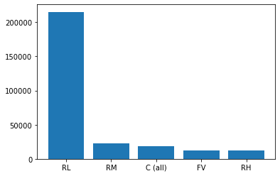


```python
# Let us see how the price of the lot varies based on the utilities available in the lot
# Let us first see if we have a normal distributon on the SalePrice
df1['SalePrice'].hist()

# The price data we have seems to be right skewed and we have less data with high prices
```


    <matplotlib.axes._subplots.AxesSubplot at 0x7fbfa3cccfa0>


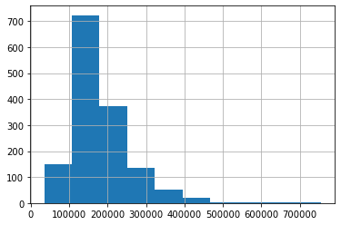


```python
# Let us see how log transformation alters the distribution
import numpy as np
df1['SalePrice'].apply(np.log).hist()
```


    <matplotlib.axes._subplots.AxesSubplot at 0x7fbfa5c72670>


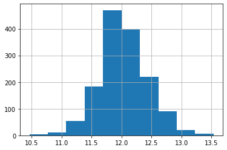


```python
# The log transformation seems to be normalizing the Price values. So let us alter the dataframe
df1['SalePrice'] = df1['SalePrice'].apply(np.log)
df1['SalePrice'].hist()
```

    <ipython-input-136-614513ba562d>:2: SettingWithCopyWarning: 
    A value is trying to be set on a copy of a slice from a DataFrame.
    Try using .loc[row_indexer,col_indexer] = value instead
    
    See the caveats in the documentation: https://pandas.pydata.org/pandas-docs/stable/user_guide/indexing.html#returning-a-view-versus-a-copy
      df1['SalePrice'] = df1['SalePrice'].apply(np.log)


    <matplotlib.axes._subplots.AxesSubplot at 0x7fbfa3bb2ac0>


```python
# Let us see how the LotArea varies with SalePrice
import seaborn as sns
sns.lineplot(x='LotArea', y = 'SalePrice', data = df1)
plt.show()
```


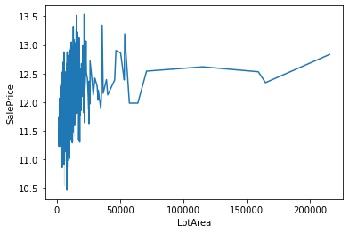


```python
# The SalePrice seems to be varies greatly for lots with less areas 
# whereas it is consistent between 1,00,000 and 1,50,000 and then increases

# Let us try plotting for SalePrice for smaller lot area to get clear picture
sns.lineplot(x='LotArea', y = 'SalePrice', data = df1[df1['LotArea'] <= 20000])
plt.show()

# Yes. As expected there is too much variation in SalePrice for smaller lot size
```


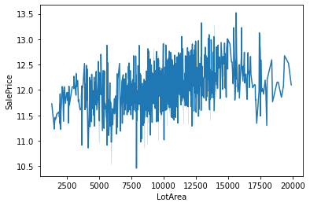


```python
# Let us see the SaleCondition variable for these small lot size
smalllots = df1[df1['LotArea'] <= 20000]
sns.boxplot(x='SaleCondition', y='LotArea', data = smalllots)
plt.show()

# From below plot we can see there has been Abnormal sales between 7500 and 10000 
# which might answer why the Price is not consistent in this lot range.
# Also there has been many sales between Families and linked properties. 
# So there is chance that those who sold and bought might not agree as per market standards 
# of the lot which caused variation in Price
```


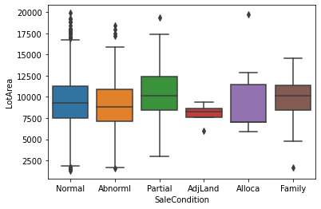


```python
# But less us also identify if the Lot Area data is normally distrbuted
df1['LotArea'].hist()

# Now we can see that the LotArea data we have is also right skewed which means we have less data for larger lot area.
# This might be main reason we see Price variation for small lot sizes whereas for large lot size there is less variation.
# Since there is less data for large lots there is not much variation in Price.
```


    <matplotlib.axes._subplots.AxesSubplot at 0x7fbfa52da9d0>


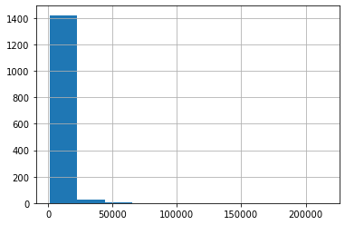


```python
# Let us see how log transform alters Lot area
df1['LotArea'].apply(np.log).hist()

# Let us try applying this transformation
df1['LotArea'] = df1['LotArea'].apply(np.log)
```

    <ipython-input-141-e05984677f7d>:5: SettingWithCopyWarning: 
    A value is trying to be set on a copy of a slice from a DataFrame.
    Try using .loc[row_indexer,col_indexer] = value instead
    
    See the caveats in the documentation: https://pandas.pydata.org/pandas-docs/stable/user_guide/indexing.html#returning-a-view-versus-a-copy
      df1['LotArea'] = df1['LotArea'].apply(np.log)


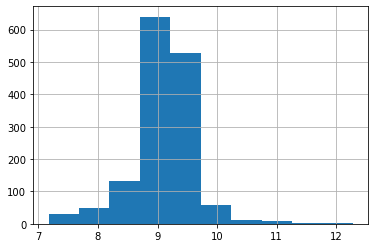


```python
# Let us see the SaleCondition variable for these small lot size
# Let us see the SaleCondition variable for these small lot size
smalllots = df1[df1['LotArea'] <= 10]
sns.boxplot(x='SaleCondition', y='LotArea', data = smalllots)
plt.show()

# Even now there are more abnormal and family sales which might cause variation in Price
```


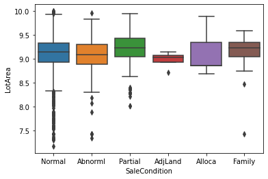


```python
# Now let us see how Price varies based on Utilies available
plt.bar(df1['Utilities'], df1['SalePrice'])
plt.show()

df1['Utilities'].hist()

# As we can see from below graphs there is no sale data for lots with NoSewr and ELO.
# However the Price is more for lots with all the utilities which makes sense
```


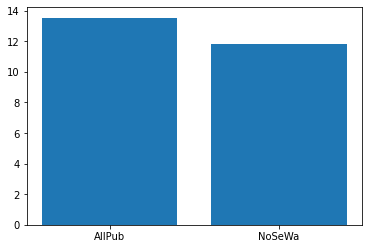


    <matplotlib.axes._subplots.AxesSubplot at 0x7fbfa5366df0>


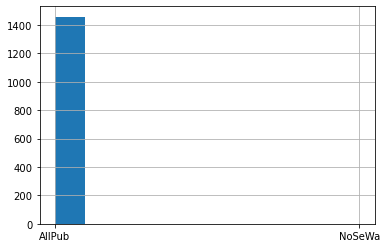


```python
# Now let us see how Price varies based on Foundation
plt.bar(df1['Foundation'], df1['SalePrice'])
plt.show()

# Here we can see the Price is almost same for all foundation.
```


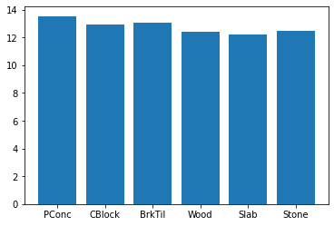


```python
# Let us now see how Price varies based on the year of construction
sns.lineplot(x='YearBuilt', y = 'SalePrice', data = df1)
plt.show()

#Here it is obvious that the Price increases based on the Year of creation but has been consistent in between

sns.lineplot(x='YearBuilt', y = 'SalePrice', data = df1[df1['YearBuilt'] != df1['YearRemodAdd']])
plt.show()

# Here we can see that if the house is remodelled then the Price increases
```


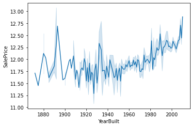


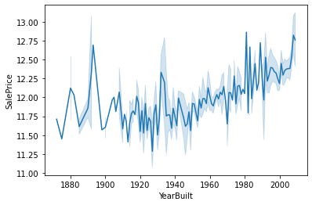


```python
# Let us now see how Price varies based on the quality of the lot
sns.lineplot(x='OverallQual', y = 'SalePrice', data = df1)
plt.show()

# As expected as quality increases the Price also increases
```


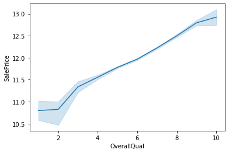


```python

```
